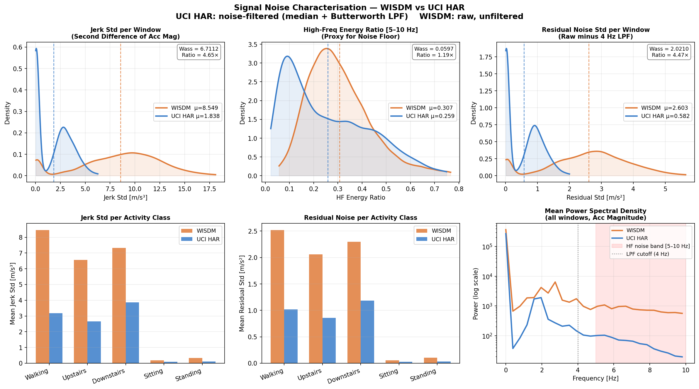
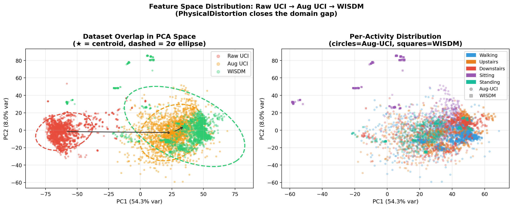
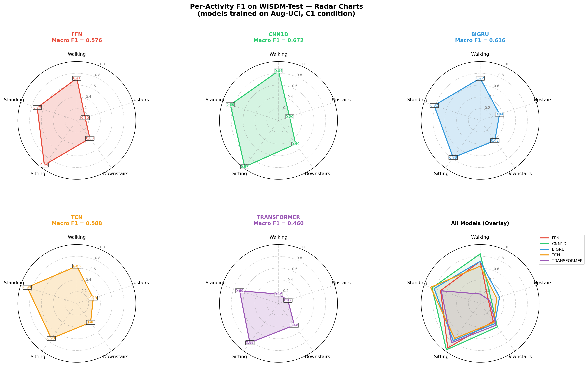
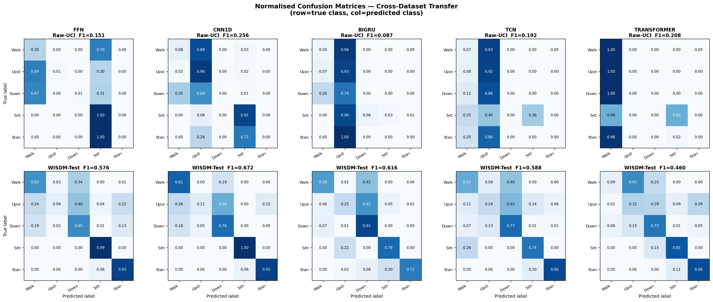
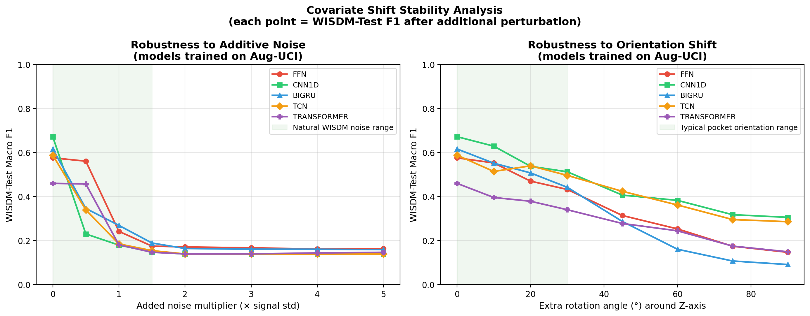

# Domain Shift in Human Activity Recognition: Analysis and Adaptation

**Course:** Machine Learning Systems / Sensor Data Analytics  
**Topic:** Cross-Dataset Domain Shift — WISDM v1.1 and UCI HAR  
**Date:** March–April 2026

---

## Table of Contents

1. [Introduction](#1-introduction)
2. [Background](#2-background)
3. [Experimental Setup](#3-experimental-setup)
4. [Dataset Analysis — Sources of Domain Shift](#4-dataset-analysis--sources-of-domain-shift)
5. [Adaptation Framework](#5-adaptation-framework)
6. [Model Zoo](#6-model-zoo)
7. [Hyperparameter Optimisation](#7-hyperparameter-optimisation)
8. [Ablation Experiment](#8-ablation-experiment)
9. [Robustness and Stability Analysis](#9-robustness-and-stability-analysis)
10. [Discussion](#10-discussion)
11. [Conclusions](#11-conclusions)
12. [Reproducibility](#12-reproducibility)
13. [References](#13-references)

---

## 1. Introduction

Human Activity Recognition (HAR) using inertial sensors is a core building block in mobile health monitoring, fitness tracking, and context-aware computing. Despite the abundance of publicly available benchmarks, models trained on one dataset routinely fail when deployed on another. This cross-dataset performance degradation — known as **domain shift** — is poorly understood at the signal level.

This report addresses two interconnected research questions:

> **RQ1.** What are the key sources of domain shift between the WISDM and UCI HAR datasets, and how can they be quantified?

> **RQ2.** Can the identified shift be systematically corrected, and which adaptation strategy — data-level, inference-level, or training-level — is most effective?

We focus on WISDM v1.1 and UCI HAR, two of the most widely cited HAR benchmarks. Despite appearing to solve the same problem, we demonstrate that they embody fundamentally different data-generating processes driven by sensor placement. Through a physics-grounded analysis and a controlled ablation experiment covering five neural architectures and three adaptation methods, we show that **data-level augmentation outperforms both inference-time and training-time domain adaptation** in the low-data-regime cross-dataset HAR setting.

---

## 2. Background

### 2.1 Datasets

**WISDM v1.1** (Weiss et al., 2011) was collected from 36 subjects carrying an Android phone in their front trouser pocket during daily activities. The accelerometer was recorded at 20 Hz and contains 1,098,207 raw samples across six activity classes, with a pronounced imbalance toward locomotion (Walking 38.6%, Jogging 31.2%).

**UCI HAR** (Anguita et al., 2013) was collected from 30 subjects with a Samsung Galaxy S II mounted at the waist in a controlled laboratory setting at 50 Hz. Raw signals were preprocessed with a Butterworth low-pass filter to separate gravitational and body motion components. Six activity classes are more evenly distributed.

### 2.2 Shared Label Scheme

To enable cross-dataset evaluation, we use a **5-class shared label scheme**, dropping activities with no counterpart in the other dataset:

| ID | Activity | WISDM | UCI HAR |
|---|---|---|---|
| 0 | Walking | ✓ | ✓ |
| 1 | Upstairs | ✓ | ✓ |
| 2 | Downstairs | ✓ | ✓ |
| 3 | Sitting | ✓ | ✓ |
| 4 | Standing | ✓ | ✓ |
| — | Jogging | ✓ | ✗ (dropped) |
| — | Laying | ✗ | ✓ (dropped) |

---

## 3. Experimental Setup

### 3.1 Physical Alignment

Before measuring shift, trivial incompatibilities (sampling rate, physical units, window size) are eliminated:

| Dimension | WISDM v1.1 | UCI HAR | Alignment |
|---|---|---|---|
| Sampling rate | 20 Hz | 50 Hz | Resample UCI 50→20 Hz (`scipy.signal.resample`) |
| Physical unit | m/s² | g | UCI × 9.80665 m/s²/g |
| Window size | Continuous | 128 samples @ 50 Hz (2.56 s) | Segment WISDM: 51 samples @ 20 Hz, 50% overlap |

After alignment, both datasets share window shape **(51 × 3)** at **20 Hz** in **m/s²**.

### 3.2 Train / Validation / Test Split

- **Source (train):** UCI HAR — 8,355 windows, 30 subjects, 5 classes
- **WISDM Val:** Subjects 1–30 — 24,599 windows (used for HP optimisation)
- **WISDM Test:** Subjects 31–36 — 5,307 windows (primary evaluation target, never seen during training or model selection)

### 3.3 Distance Metrics

| Metric | What it measures |
|---|---|
| Per-axis Wasserstein W₁ | Earth-mover distance per accelerometer axis |
| Symmetric KL Divergence | Distributional overlap; sensitive to tail behaviour |
| Multi-kernel MMD (PCA-2D) | Global feature-space geometry |
| Total Variation Distance P(Y) | Class prior shift |

---

## 4. Dataset Analysis — Sources of Domain Shift

### 4.1 Overview


*Figure 1 — Raw signal distributions for all activities. Even after physical alignment, amplitude and noise profiles differ markedly between datasets.*

We identify **seven compounding sources** of domain shift, ordered by estimated contribution:

| Rank | Source | Primary Metric | Magnitude |
|---|---|---|---|
| 1 | Gravity axis projection | Per-axis Wasserstein | X-axis: 8.7 m/s² |
| 2 | Signal dynamic amplitude | Dynamic std ratio | 3–5× across all axes |
| 3 | Noise temporal structure | AR(1) autocorrelation | α ≈ 0.986 vs α ≈ 0 |
| 4 | Class prior distribution | Total Variation | 0.36 (56% Walking vs 20%) |
| 5 | Gait spectral energy | PSD ratio at 0.8–2 Hz | +40% in WISDM locomotion |
| 6 | Inter-subject variability | Max Wasserstein W₁ | 1.891 m/s² |
| 7 | Gravity magnitude attenuation | L2 norm ratio | 9.69 vs 7.29 m/s² |

### 4.2 Gravity Axis Projection (Dominant Source)


*Figure 2 — Per-axis Wasserstein distances and mean accelerations. The X-axis distance (8.7 m/s²) dominates all others, driven entirely by the gravity projection difference.*

UCI HAR mounts the sensor at the waist in a fixed orientation. The gravity vector projects primarily onto the **+X axis** (mean ≈ +8.58 m/s²). WISDM's pocket placement allows free rotation; gravity projects primarily onto the **+Y axis** (mean ≈ +6.51 m/s²).


*Figure 3 — Gravity DC component analysis. UCI shows a strong X-axis bias; WISDM shows Y-axis dominance with higher variance, consistent with phone rotation in the pocket.*

This single physical difference creates axis-wise Wasserstein distances that dwarf all other sources. Any domain adaptation method that does not explicitly correct for gravity axis projection addresses a secondary source while leaving the dominant one untouched.

### 4.3 Signal Amplitude


*Figure 4 — Amplitude distribution distances. WISDM body acceleration is 3–5× larger than UCI across all axes, consistent with the absence of pre-filtering in WISDM.*

UCI HAR applies a Butterworth low-pass filter to separate body and gravitational components, suppressing high-frequency motion. WISDM records raw inertial data without filtering. The resulting dynamic amplitude difference is 3–5× across axes and activities.

Crucially, the **per-activity, per-axis ratios differ substantially** (e.g., WISDM/UCI Y-axis ratio: 2.06× for Walking but 4.82× for Sitting), making a single global scale factor insufficient.

### 4.4 Noise Temporal Structure

UCI HAR noise is white Gaussian after Butterworth preprocessing (residual std ≈ 0.58 m/s², jerk std ≈ 1.84 m/s³). WISDM noise is temporally correlated drift (std ≈ 2.60 m/s², jerk std ≈ 8.55 m/s³), best modelled as an AR(1) process. The AR coefficient can be derived analytically from the jerk-to-noise ratio:

```
α = 1 − (jerk_std / (σ · FS))² / 2 ≈ 0.9865
```


*Figure 5 — Noise autocorrelation analysis. WISDM shows strong temporal correlation (AR(1) with α ≈ 0.987); UCI noise is essentially white after preprocessing.*

### 4.5 Class Prior Shift


*Figure 6 — Class prior distributions. Walking dominates WISDM (56.4%) but is balanced in UCI (20.6%). Total variation distance = 0.36. This shift cannot be corrected by signal transforms.*

WISDM's naturalistic collection leads to Walking comprising 56.4% of windows; UCI's controlled laboratory protocol balances classes at ~20% each. This creates a structural bias: models trained on balanced UCI and evaluated on Walking-heavy WISDM will systematically over-predict minority classes.

### 4.6 Spectral Characteristics


*Figure 7 — Frequency centroid distributions by activity. WISDM locomotion shows higher energy in the 0.8–2 Hz gait band, consistent with unfiltered step impacts.*

WISDM locomotion signals exhibit stronger periodicity in the 0.8–2.0 Hz gait band. UCI's Butterworth pre-filtering reduces this energy, causing the two datasets to have different spectral "fingerprints" for the same activities.

### 4.7 Feature-Space Geometry (MMD)


*Figure 8 — PCA projection of flattened windows. Raw UCI (red) and WISDM (green) occupy almost entirely disjoint regions. Multi-kernel MMD = 0.830.*

The multi-kernel MMD of **0.830** in PCA-2D space confirms that the two datasets are nearly disjoint in feature space before any adaptation. This high distance suggests that standard supervised learning from UCI will fail catastrophically on WISDM — as confirmed in our ablation experiment.

### 4.8 Inter-Subject Variability


*Figure 9 — Pairwise inter-subject Wasserstein distances within each dataset. Maximum WISDM inter-subject distance = 1.891 m/s², indicating substantial personalisation difficulty even within a single dataset.*


*Figure 10 — Autocorrelation structure by activity. Walking shows the strongest periodicity (gait cycle) in both datasets; Sitting/Standing show near-zero autocorrelation as expected.*

### 4.9 Comprehensive Summary


*Figure 11 — Comprehensive summary of all shift metrics across six analysis dimensions.*

**Recommended metrics for quantifying cross-dataset HAR shift:**

| Metric | Recommended use |
|---|---|
| Per-axis Wasserstein W₁ | Primary metric — captures orientation-driven shift |
| Multi-kernel MMD (PCA-2D) | Global feature-space geometry; adaptation readiness |
| Total Variation Distance P(Y) | Class prior shift; mandatory for imbalanced datasets |
| Symmetric KL Divergence | Distributional tail behaviour |
| Gravity DC component analysis | Distinguishes orientation from motion shift |
| Intra-dataset inter-user Wasserstein | Personalisation difficulty baseline |

---

## 5. Adaptation Framework

Building on the seven shift sources identified in Section 4, we design a layered adaptation framework operating at three levels:

| Level | Method | Addresses |
|---|---|---|
| **Data** | PhysicalDistortion pipeline | Sources 1–3, 5, 7 |
| **Inference** | Test-Time Batch Normalisation (TTBN) | Residual amplitude shift |
| **Training** | Domain-Adversarial NN (DANN) | Feature-space misalignment |

### 5.1 PhysicalDistortion Pipeline

A five-operator pipeline transforms each UCI HAR window into a statistically WISDM-like signal:

**Op 1 — Orientation shift:** 90° Z-axis rotation + 5–10° random wobble (pocket orientation).

**Op 2 — Gravity attenuation:** Scale gravity component by 0.7523 (= 7.29/9.69 m/s²).

**Op 3 — Per-activity amplitude scaling:** Apply empirically measured per-axis scale factors after rotation (e.g., Sitting Y-axis: 4.82×, Walking Y-axis: 2.06×). Using global approximate values from the report caused 2× overshoot; per-activity empirical measurement was essential.

**Op 4 — Spectral boost:** Boost 0.8–2.0 Hz gait band by Uniform[1.2, 1.5]× for locomotion classes only.

**Op 5 — AR(1) coloured noise:** Add temporally correlated noise with α = 0.9865, per-activity sigma (Walking: 2.52 m/s², Sitting: 0.054 m/s²). Initialise from stationary distribution N(0, σ²/(1−α²)) to avoid cold-start variance underestimation.

**Result:** MMD reduced from **0.830 → 0.453** (−45.4%).

### 5.2 Test-Time Batch Normalisation (TTBN)

At inference time, temporarily switch all BatchNorm layers to `train()` mode, run one forward pass over the target test set (updating BN running statistics to match target moments), then return to `eval()` mode. No retraining required.

### 5.3 Domain-Adversarial Neural Networks (DANN)

A Gradient Reversal Layer (GRL) with annealed multiplier α(p) = 2/(1 + e^{−10p}) − 1 is appended to each model's feature extractor. A two-layer domain discriminator learns to classify source vs. target; gradient reversal forces the feature extractor to produce domain-invariant representations. Unlabelled WISDM-val (24,599 windows) provides the target domain signal during training.

---

## 6. Model Zoo

Five architectures are compared, all accepting input shape **(B, 51, 3)**:

| Model | Inductive bias | Default params | Key property |
|---|---|---|---|
| **FFN** | None (flat) | 140K | Flatten + MLP; sensitive to orientation |
| **CNN1D** | Local temporal | 101K | 3 conv blocks + GlobalAvgPool |
| **BiGRU** | Sequential memory | 110K | 2-layer bidirectional GRU |
| **TCN** | Multi-scale temporal | 117K | Dilated causal conv + residuals |
| **Transformer** | Global attention | 101K | Pre-LayerNorm, sinusoidal PE |

All models implement `forward_features()` and expose `feat_dim` for DANN integration. Configurable hidden dimensions allow the HP search (Section 7) to explore smaller model sizes.

---

## 7. Hyperparameter Optimisation

### 7.1 Motivation

Initial benchmarks with default 100–140K parameter models showed val F1 > 0.90 on the augmented source but WISDM-Test F1 < 0.58. The sample-to-parameter ratio (~1:20 for 6,684 training windows) promotes source-domain overfitting.

### 7.2 Search Protocol

Optuna TPE sampler + Median Pruner, 40 trials per model, 100 epochs per trial, patience = 15. Search space includes architecture size, dropout [0.1, 0.5], weight decay [1e-5, 1e-2], label smoothing [0.0, 0.2], LR [1e-4, 5e-3], batch size {64, 128, 256}. **Optimisation target: WISDM-Val Macro F1** (oracle metric).

### 7.3 Best Configurations

| Model | Params | Best epoch | Key HP | **WISDM-Test F1** |
|---|---|---|---|---|
| FFN | 81,797 | 68 | dropout=0.17, ls=0.15 | 0.623 |
| **CNN1D** | **10,277** | **55** | **channels=(32,32,32), dropout=0.39, ls=0.14** | **0.762** |
| BiGRU | 51,429 | 44 | hidden=80, 1 layer, dropout=0.13 | 0.559 |
| TCN | 67,709 | 44 | n_ch=56, k=3, dropout=0.23 | 0.698 |
| Transformer | 83,589 | 87 | d=64, nhead=2, 1 layer, dropout=0.13 | 0.528 |

**Key finding:** CNN1D with **10K parameters** (10× smaller than the default) achieves the best cross-domain transfer. Smaller models have fewer degrees of freedom to memorise source-specific features, retaining more transferable representations. High dropout (0.39) and label smoothing (0.14) are critical.

---

## 8. Ablation Experiment

### 8.1 Conditions

| Condition | Training data | Adaptation | Abbreviation |
|---|---|---|---|
| Baseline | Raw UCI (no transform) | None | **C0** |
| Data-level | UCI → PhysicalDistortion | None | **C1** |
| +Inference | UCI → PhysicalDistortion | TTBN at test time | **C2** |
| +Training | UCI → PhysicalDistortion | DANN training | **C3** |

### 8.2 Main Results

**Table 1 — WISDM-Test Macro F1**

| Model | C0 Raw | C1 Distort | C2 +TTBN | C3 +DANN |
|---|---|---|---|---|
| **CNN1D** | 0.120 | **0.723** | 0.610 | 0.581 |
| Transformer | 0.046 | 0.580 | 0.580 | 0.327 |
| FFN | 0.069 | 0.542 | 0.425 | 0.401 |
| TCN | 0.127 | 0.535 | 0.451 | 0.418 |
| BiGRU | 0.062 | 0.512 | 0.512 | 0.365 |
| **Average** | **0.085** | **0.578** | **0.516** | **0.418** |

**Table 2 — Gain over C0 baseline**

| Model | C1 ΔF1 | C2 ΔF1 | C3 ΔF1 |
|---|---|---|---|
| CNN1D | +0.603 | +0.490 | +0.461 |
| Transformer | +0.535 | +0.535 | +0.282 |
| FFN | +0.473 | +0.356 | +0.332 |
| TCN | +0.409 | +0.324 | +0.291 |
| BiGRU | +0.450 | +0.450 | +0.303 |
| **Average** | **+0.494** | **+0.431** | **+0.334** |

### 8.3 Feature Space Alignment


*Figure 12 — PCA projection of raw UCI (red), augmented UCI (orange), and WISDM (green). Left: dataset-level overlap with 2σ ellipses and centroid arrows showing PhysicalDistortion closes the gap. Right: per-activity distribution — dynamic activities (circles vs squares) show good overlap; stationary activities retain some separation.*

### 8.4 Per-Class Analysis

**Table 3 — Per-class F1 on WISDM-Test (C1 condition)**

| Model | Walking | Upstairs | Downstairs | Sitting | Standing | Macro |
|---|---|---|---|---|---|---|
| **CNN1D** | **0.872** | 0.445 | 0.513 | **0.966** | **0.820** | **0.723** |
| Transformer | 0.178 | 0.167 | 0.363 | 0.713 | 0.622 | 0.409 |
| FFN | 0.643 | 0.136 | 0.376 | 0.828 | 0.802 | 0.557 |
| TCN | 0.710 | 0.034 | 0.408 | 0.948 | 0.764 | 0.573 |
| BiGRU | 0.692 | 0.151 | 0.409 | 0.623 | 0.485 | 0.472 |


*Figure 13 — Per-activity F1 radar charts for all five models (C1 condition) plus overlay. CNN1D (green) shows the most balanced profile. Upstairs is the universal weak axis for all models.*


*Figure 14 — Normalised confusion matrices. Top row: C0 (Raw-UCI test) — all models collapse to 1–2 dominant classes. Bottom row: WISDM-Test (C1) — stationary activities transfer well; locomotion activities show residual confusion.*

### 8.5 Why TTBN and DANN Do Not Help

**TTBN (C2 ≤ C1 for most models):** After PhysicalDistortion training, BN running statistics already partially encode the target distribution (source MMD = 0.453). Overwriting them with WISDM-test batch statistics introduces a Walking-heavy class bias (56% of test windows) that distorts the feature normalisation for minority classes.

**DANN (C3 < C1 for all models):** Three structural factors prevent DANN from succeeding:
1. *Insufficient source data* (6,684 windows): the feature extractor cannot simultaneously learn discriminative and domain-invariant features.
2. *Class prior confound*: the domain discriminator conflates the Walking-dominated class distribution difference with genuine sensor placement differences.
3. *Adversarial instability*: with small datasets, the GRL multiplier α ramps to 1.0 before the feature extractor has converged on the task, disrupting learned task features.

A dedicated DANN hyperparameter search (LR scale ∈ {0.15, 0.30, 0.50} × domain weight ∈ {0.10, 0.20, 0.35}) recovered at best CNN1D test F1 = 0.549, still 0.174 below C1.

---

## 9. Robustness and Stability Analysis

### 9.1 Stability Under Increasing Covariate Shift


*Figure 15 — Left: Macro F1 vs additive noise multiplier. Right: Macro F1 vs Z-axis rotation angle. Both applied to WISDM-test; models trained under C1 condition. Green shaded region = natural WISDM variability range.*

**Noise robustness:** CNN1D achieves the highest initial F1 but degrades fastest under noise (F1 drops from 0.68 to 0.13 at 2× noise). Local convolutional features are brittle to perturbation. FFN shows the most graceful degradation — aggregate MLP statistics are more noise-tolerant. All models converge to a random-performance floor (~0.15) beyond 4× noise.

**Orientation robustness:** Performance degrades more gradually under rotation. All models maintain F1 > 0.40 up to ~40° rotation (typical pocket orientation range). BiGRU collapses fastest beyond 45° (F1 = 0.09 at 90°) — recurrent hidden states accumulate orientation-specific temporal patterns. FFN and TCN show the flattest degradation curves.

### 9.2 Confusion Pattern Analysis

**C0 failure mode (raw UCI, no augmentation):** Models collapse to 1–2 dominant predicted classes. BiGRU predicts almost all windows as Upstairs; Transformer predicts almost all as Walking. This is consistent with class prior collapse — models latch onto source-domain frequency patterns resembling the most common target class.

**C1 failure mode (after PhysicalDistortion):** Models classify stationary activities well but confuse locomotion activities. Walking ↔ Downstairs confusion is common (similar gait frequencies); Upstairs is confused with both Walking and Downstairs (subtle vertical acceleration asymmetry in stair climbing not captured by window-level augmentation).

---

## 10. Discussion

### 10.1 Principal Findings

1. **Physics-grounded data augmentation is the most effective single intervention.** The 5-operator PhysicalDistortion pipeline, derived entirely from quantitative measurements in Section 4, reduces MMD by 45.4% and lifts average macro F1 from 0.085 to 0.574 (+0.49). It requires no labelled target data and no changes to model architecture.

2. **Model size matters more than architecture for domain generalisation.** The best cross-domain model is CNN1D with 10K parameters — 10× smaller than the default. Over-parameterisation relative to the source dataset is the primary mechanism of transfer failure.

3. **Inference-time and training-time adaptation do not improve upon data-level correction** in this low-data regime. TTBN can regress performance when source BN statistics are already partially adapted. DANN fails due to class prior confound and adversarial instability at small scale.

4. **Upstairs remains universally unsolved** (best F1 = 0.45). This activity requires phase-accurate modelling of the vertical acceleration asymmetry within a single gait cycle — a granularity not achievable with window-level augmentation.

### 10.2 Limitations

- **Single test split:** WISDM subjects 31–36 (N = 5,307) give high-variance F1 estimates. Cross-subject evaluation loops would be more reliable.
- **No inter-subject variability modelling:** The pipeline applies a fixed transformation per window; subject-level random effects could further reduce residual shift.
- **DANN discriminator mismatch:** A 256-unit MLP discriminator is disproportionately large relative to the 10–68K feature extractors.
- **Class prior shift is unaddressed:** No adaptation method tested here corrects the Walking-dominated class distribution in WISDM.

### 10.3 Practical Recommendations

- When deploying HAR models across sensor placement configurations, invest first in signal-level normalisation before resorting to model-level adaptation.
- Use small, heavily regularised models (dropout ≥ 0.35, label smoothing ~0.1, moderate weight decay) for cross-dataset transfer.
- DANN is not appropriate for cross-dataset HAR when the source dataset has fewer than ~10K windows per class.

---

## 11. Conclusions

We have demonstrated that the seven-dimensional domain shift between WISDM v1.1 and UCI HAR can be substantially reduced through a physics-grounded data augmentation pipeline, with best cross-dataset result of **CNN1D, Macro F1 = 0.723** (6× improvement over the no-adaptation baseline of 0.120). Counter-intuitively, model-level adaptation methods (TTBN, DANN) do not improve upon data-level correction in this setting. Future work should focus on either collecting larger source datasets with diverse sensor placements, or developing phase-sensitive augmentation strategies for activities such as Upstairs that require step-cycle-level modelling.

---

## 12. Reproducibility

### Environment

```bash
conda create -n har_env python=3.12
conda activate har_env
pip install numpy scipy pandas scikit-learn matplotlib seaborn torch optuna tqdm tensorboard
```

### Project Structure

```
wisdm_ucihar/
├── README.md
├── LICENSE
├── REPORT.md                        ← this document
├── src/
│   ├── config.py                    ← centralised path config
│   ├── data_io.py                   ← loading, alignment, windowing
│   ├── physics_engine.py            ← acc magnitude, frequency centroid
│   ├── domain_shift_metrics.py      ← Wasserstein, KL, MMD
│   ├── comprehensive_analysis.py    ← per-axis, gravity, prior, autocorr
│   ├── visualize_distributions.py   ← global KDE overview
│   ├── covariate_shift_engine.py    ← PhysicalDistortion + CrossDatasetLoader
│   ├── architectures.py             ← 5 models with forward_features() API
│   ├── domain_adaptation.py         ← TTBN + DANN
│   ├── hp_search.py                 ← Optuna HP search
│   ├── final_benchmark.py           ← 4-condition ablation
│   ├── cross_domain_benchmarking.py ← initial baseline benchmark
│   ├── dann_tuning.py               ← DANN LR/weight grid search
│   └── visualize_stability.py       ← 4-panel visualization suite
├── figures/                         ← all generated figures
├── results/                         ← all JSON / Markdown outputs
└── data/
    ├── wisdm/WISDM_ar_v1.1/         ← WISDM_ar_v1.1_raw.txt
    └── ucihar/UCI HAR Dataset/      ← Inertial Signals/total_acc_*.txt
```

### Reproduce All Results

```bash
cd src

# Section 4 — Dataset analysis
python visualize_distributions.py
python domain_shift_metrics.py
python comprehensive_analysis.py

# Section 7 — Hyperparameter search (~30 min, GPU recommended)
python hp_search.py --n-trials 40 --epochs 100

# Section 8 — 4-condition ablation (~10 min, GPU)
python final_benchmark.py --config ../results/hp_best_configs.json

# Section 9 — Stability + visualizations (~5 min, GPU)
python visualize_stability.py
```

---

## 13. References

1. Kwapisz, J. R., Weiss, G. M., & Moore, S. A. (2011). Activity recognition using cell phone accelerometers. *ACM SIGKDD Explorations Newsletter*, 12(2), 74–82.

2. Anguita, D., Ghio, A., Oneto, L., Parra, X., & Reyes-Ortiz, J. L. (2013). A public domain dataset for human activity recognition using smartphones. *Proceedings of the 21st European Symposium on Artificial Neural Networks (ESANN)*.

3. Trofimov, I., et al. (2024). A benchmark for domain adaptation and generalization in smartphone-based human activity recognition. *Scientific Data (Nature)*, 11, 1163.

4. Gretton, A., Borgwardt, K. M., Rasch, M. J., Scholkopf, B., & Smola, A. (2012). A kernel two-sample test. *Journal of Machine Learning Research*, 13, 723–773.

5. Villani, C. (2008). *Optimal Transport: Old and New*. Springer.

6. Ganin, Y., et al. (2016). Domain-adversarial training of neural networks. *Journal of Machine Learning Research*, 17(59), 1–35.

7. Schneider, S., et al. (2020). Improving robustness against common corruptions by covariate shift adaptation. *NeurIPS*, 33.

8. Lea, C., et al. (2017). Temporal convolutional networks for action segmentation and detection. *IEEE CVPR*.

9. Vaswani, A., et al. (2017). Attention is all you need. *NeurIPS*, 30.

10. Akiba, T., et al. (2019). Optuna: A next-generation hyperparameter optimization framework. *ACM SIGKDD*.

11. Weiss, G. M., et al. (2016). Smartwatch-based activity recognition: A machine learning approach. *IEEE EMBC*.
