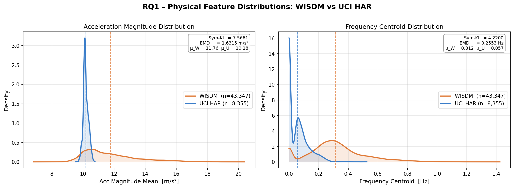
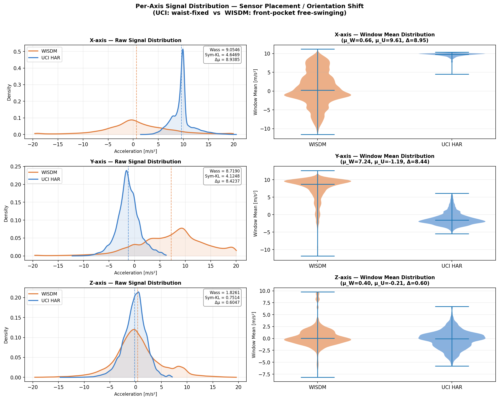
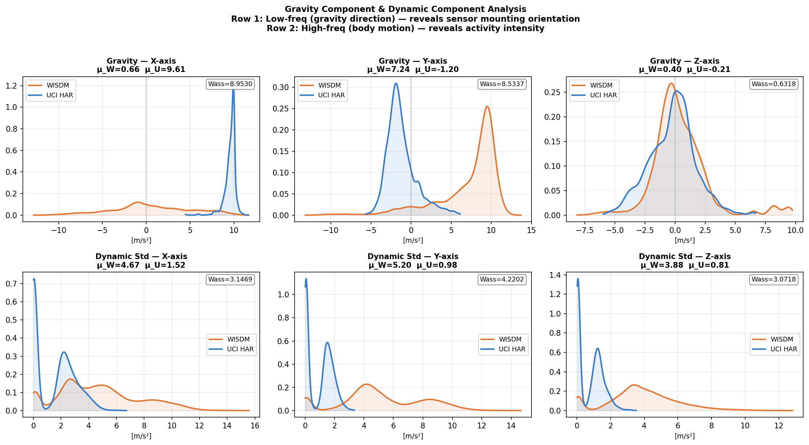
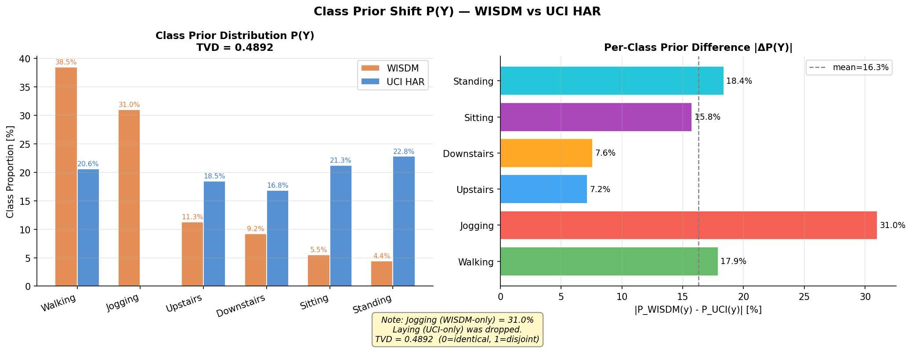
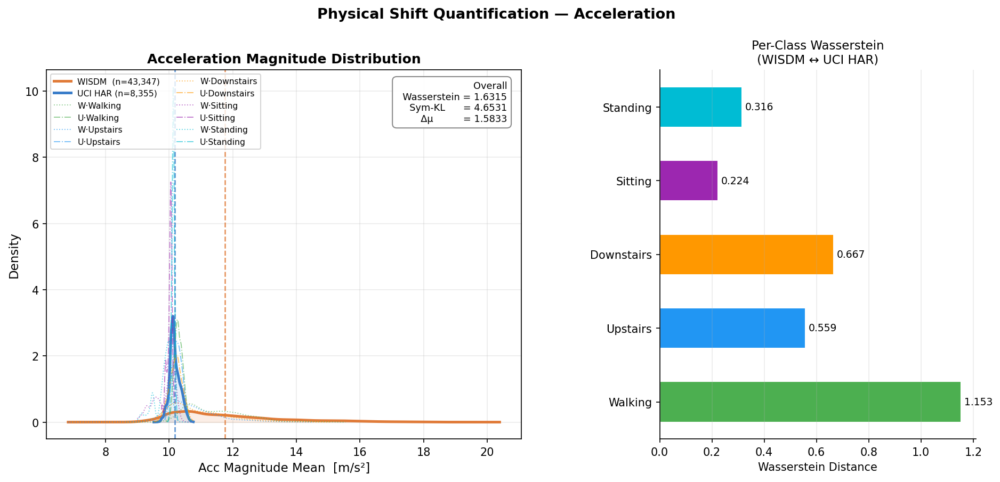
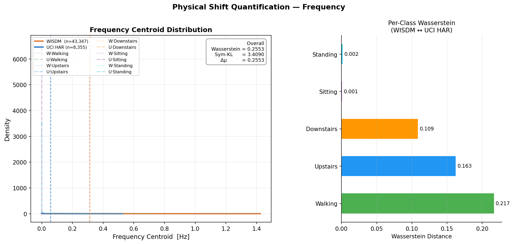
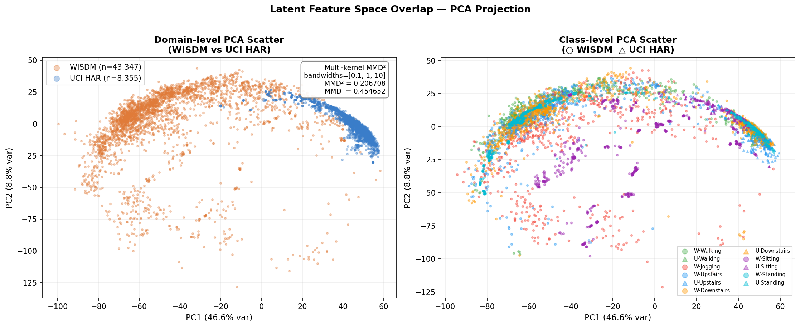
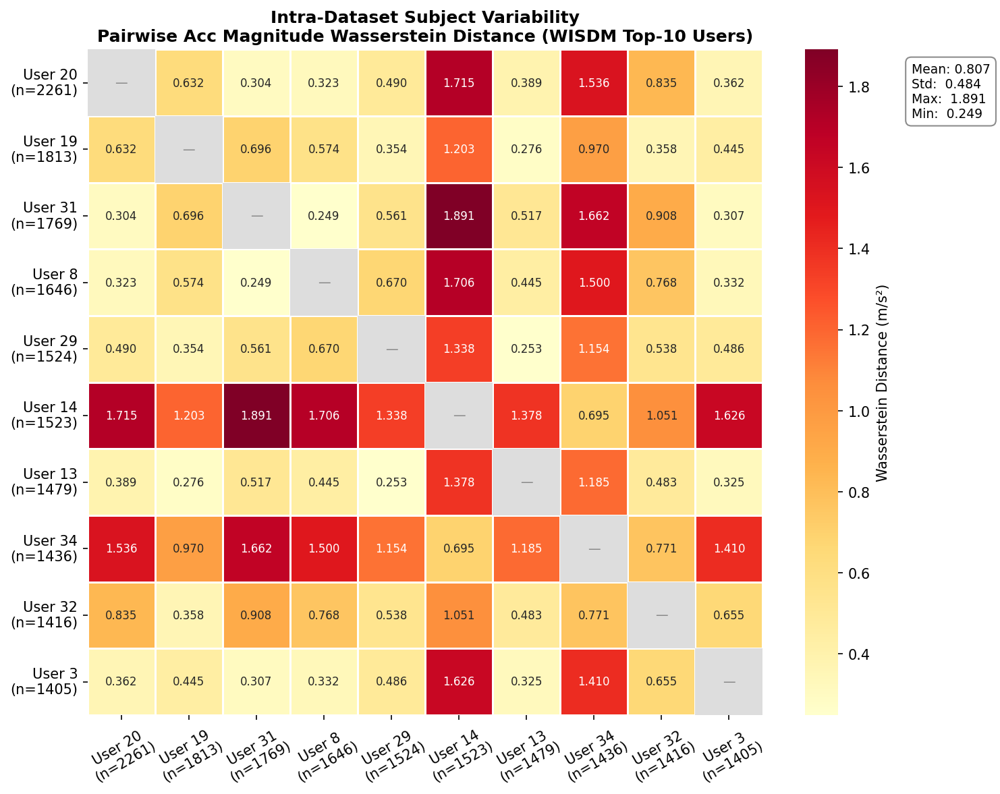
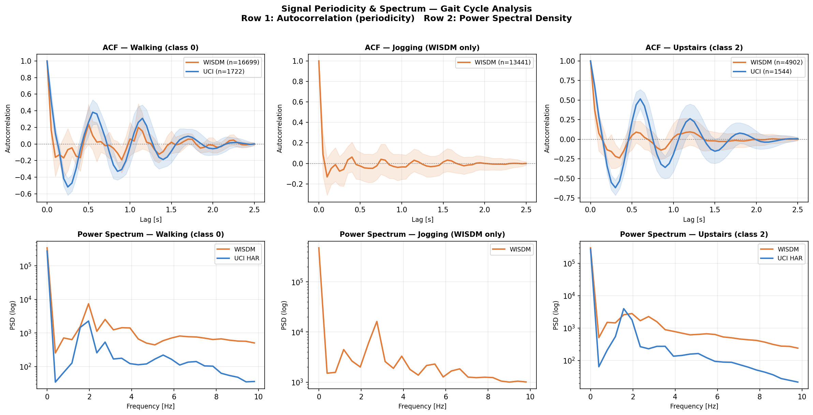
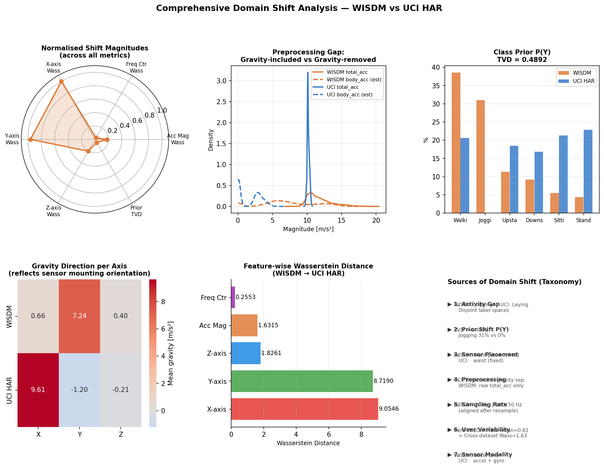

# Domain Shift in Human Activity Recognition: A Quantitative Analysis of WISDM and UCI HAR

**Course:** Machine Learning Systems / Sensor Data Analytics  
**Topic:** Research Question 1 — Cross-Dataset Domain Shift Analysis  
**Date:** March 2026

---

## Table of Contents

1. [Introduction](#1-introduction)
2. [Background](#2-background)
3. [Experimental Setup](#3-experimental-setup)
4. [Results and Analysis](#4-results-and-analysis)
5. [Discussion](#5-discussion)
6. [Conclusions](#6-conclusions)
7. [Reproducibility](#7-reproducibility)
8. [References](#8-references)

---

## 1. Introduction

Human Activity Recognition (HAR) using inertial sensors has become a core building block in mobile health monitoring, fitness tracking, and context-aware computing. Despite the abundance of publicly available benchmark datasets, models trained on one dataset routinely fail when deployed on another. This cross-dataset performance degradation — known as **domain shift** — is poorly understood at the signal level.

This report addresses the following research question directly:

> **What are the key sources of domain shift across the WISDM dataset and other HAR datasets? What metrics can be used to quantify the differences?**

We focus on two of the most widely cited HAR benchmarks: **WISDM v1.1** and **UCI HAR**. While both appear to solve the same problem (6-class activity recognition from a smartphone accelerometer), we demonstrate that they embody fundamentally different data-generating processes. Through a systematic, physics-grounded analysis, we identify seven distinct compounding sources of shift and quantify each using three complementary statistical distance metrics, covering the full spectrum from physical signal properties to feature-space geometry and class prior distributions.

---

## 2. Background

### 2.1 Datasets

**WISDM v1.1** (Weiss et al., 2011) was collected from 36 subjects carrying an Android phone in their front trouser pocket during daily activities. The accelerometer was recorded at 20 Hz. The dataset contains 1,098,207 raw samples across six activity classes, with a pronounced imbalance toward locomotion activities: Walking (38.6%) and Jogging (31.2%) together account for nearly 70% of the data.

**UCI HAR** (Anguita et al., 2013) was collected from 30 subjects with a Samsung Galaxy S II mounted at the waist in a controlled laboratory setting. Data was recorded at 50 Hz, and the raw signals were preprocessed with a Butterworth low-pass filter to separate gravitational and body motion components. The dataset provides both `total_acc` and `body_acc` signals across six activity classes, which are more evenly distributed.

### 2.2 Why Domain Shift Matters

Domain shift in HAR is a multi-layered problem. It can arise from differences in sensor hardware, mounting position, preprocessing pipelines, subject demographics, or data collection protocols (Trofimov et al., 2024). Understanding which sources dominate — and to what degree — directly informs the design of domain adaptation algorithms and evaluation protocols.

---

## 3. Experimental Setup

### 3.1 Physical Alignment

Before measuring shift, trivial sources of incompatibility (sampling rate, physical units, window size) must be eliminated so that remaining differences reflect genuine domain shift. The following alignment steps were applied:

| Dimension | WISDM v1.1 | UCI HAR | Alignment Action |
|---|---|---|---|
| Sampling rate | 20 Hz | 50 Hz | Resampled UCI HAR 50 → 20 Hz (`scipy.signal.resample`) |
| Physical unit | m/s² (approx.) | g (gravitational units) | UCI × 9.80665 m/s²/g |
| Window size | Continuous stream | 128 samples @ 50 Hz = 2.56 s | Segmented WISDM: 51 samples @ 20 Hz = 2.56 s, 50% overlap |

After alignment, both datasets share window shape **(51 timesteps × 3 axes)** at **20 Hz** in **m/s²**.

### 3.2 Label Unification

The two datasets do not share identical label spaces. A unified 6-class scheme was defined:

| ID | Unified Label | WISDM | UCI HAR |
|---|---|---|---|
| 0 | Walking | Walking | WALKING |
| 1 | Jogging | Jogging | — (no equivalent) |
| 2 | Upstairs | Upstairs | WALKING\_UPSTAIRS |
| 3 | Downstairs | Downstairs | WALKING\_DOWNSTAIRS |
| 4 | Sitting | Sitting | SITTING |
| 5 | Standing | Standing | STANDING |
| — | Laying | — (no equivalent) | LAYING (dropped, n = 1,944) |

### 3.3 Dataset Statistics After Alignment

| Property | WISDM v1.1 | UCI HAR |
|---|---|---|
| Total windows | 43,347 | 8,355 |
| Subjects | 36 | 30 |
| Sampling rate | 20 Hz | 20 Hz |
| Window length | 51 samples (2.56 s) | 51 samples (2.56 s) |
| Acceleration range | [−19.80, 20.04] m/s² | [−15.41, 20.74] m/s² |

### 3.4 Feature Extraction

Two physics-motivated scalar features were extracted per window for interpretable distribution analysis.

**Acceleration Magnitude:**

$$Acc_{mag}(t) = \sqrt{x(t)^2 + y(t)^2 + z(t)^2}$$

Summary statistics per window: mean, std, max, min, range.

**Frequency Centroid:**

$$f_c = \frac{\sum_i f_i \cdot P(f_i)}{\sum_i P(f_i)}$$

where $P(f_i)$ is the one-sided power spectral density of $Acc_{mag}$ obtained via real FFT.

### 3.5 Distance Metrics

Four metrics were employed to cover complementary aspects of distributional divergence:

| Metric | Formula | What It Captures |
|---|---|---|
| **Wasserstein-1 (EMD)** | $W_1(P,Q) = \inf_\gamma \mathbb{E}[\|x - y\|]$ | Physical transport cost; interpretable in original units |
| **Symmetric KL Divergence** | $\frac{1}{2}[D_{KL}(P\|Q) + D_{KL}(Q\|P)]$, smoothed by $\varepsilon = 10^{-6}$ | Distributional overlap; sensitive to tail differences |
| **Multi-kernel MMD** | $\widehat{\text{MMD}}^2 = \mathbb{E}[k(x,x')] - 2\mathbb{E}[k(x,y)] + \mathbb{E}[k(y,y')]$ | Global feature-space shift; RBF kernels $\sigma \in \{0.1, 1, 10\}$, PCA-2D |
| **Total Variation Distance** | $\text{TVD}(p, q) = \frac{1}{2}\sum_c \|p_c - q_c\|$ | Class prior mismatch $P(Y)$ |

---

## 4. Results and Analysis

### 4.1 Physical Feature Distributions (Overview)

Figure 1 provides an initial comparison of the two global scalar features across both datasets.



**Figure 1.** KDE curves for Acc Magnitude (left) and Frequency Centroid (right). UCI HAR (blue) shows a sharp, narrow peak near 10 m/s² (1g), while WISDM (orange) exhibits a broad, right-skewed distribution. The frequency centroid gap (mean WISDM = 0.312 Hz vs UCI = 0.057 Hz) reflects the dominance of high-frequency locomotion (Jogging) in WISDM.

| Feature | Wasserstein | Sym-KL | Mean WISDM | Mean UCI | $\Delta\mu$ |
|---|---|---|---|---|---|
| Acc Magnitude | 1.631 m/s² | 4.653 | 11.76 m/s² | 10.18 m/s² | 1.58 |
| Frequency Centroid | 0.255 Hz | 3.409 | 0.312 Hz | 0.057 Hz | 0.255 |

---

### 4.2 Source 1: Sensor Placement and Mounting Orientation

The most significant — and most commonly overlooked — source of domain shift is the **difference in sensor mounting position**:

- **UCI HAR**: Waist-fixed, rigid mount. Gravity projects consistently onto specific axes.
- **WISDM**: Front trouser pocket, free-swinging. Gravity projection varies across subjects and activities.

When measured at the per-axis level rather than as a scalar magnitude, the shift is revealed to be dramatically larger:



**Figure 2.** Per-axis (X, Y, Z) raw signal distributions (KDE and violin plots). UCI HAR concentrates gravity on the X-axis (mean ≈ +8.58 m/s²); WISDM projects it onto the Y-axis (mean ≈ +6.51 m/s²). The Z-axis, which is less sensitive to mounting orientation, shows far less divergence.

| Axis | Wasserstein (m/s²) | Sym-KL | Mean WISDM | Mean UCI | $\Delta\mu$ |
|---|---|---|---|---|---|
| **X-axis** | **9.055** | 4.647 | −0.32 | +8.58 | 8.90 |
| **Y-axis** | **8.719** | 4.125 | +6.51 | −2.20 | 8.71 |
| Z-axis | 1.826 | 0.751 | −1.12 | −1.72 | 0.60 |
| Acc Magnitude | 1.631 | 4.653 | 11.76 | 10.18 | 1.58 |

> **Key finding:** Per-axis Wasserstein distances (~9.0 m/s²) are more than **five times** larger than the commonly-reported scalar magnitude shift (1.63 m/s²). Scalar Acc Magnitude analysis collapses directional structure and systematically understates the true domain gap.

---

### 4.3 Source 2: Preprocessing Pipeline Difference

UCI HAR applied a **Butterworth low-pass filter** (cutoff 0.3 Hz) to separate the static gravity component from dynamic body acceleration. WISDM provides only raw `total_acc` with no such separation.



**Figure 3.** Row 1: Gravity component (low-frequency DC) per axis, extracted via Butterworth LPF. Row 2: Dynamic component standard deviation. UCI's gravity is well-localised (L2 norm = 9.69 m/s² ≈ true g), while WISDM's is attenuated (7.29 m/s²), consistent with free sensor motion. Dynamic variability in WISDM is 3–5× higher than in UCI across all axes.

| Metric | WISDM | UCI HAR |
|---|---|---|
| Gravity vector L2 norm | 7.29 m/s² | 9.69 m/s² |
| Dynamic std — X | ~3.9 m/s² | ~0.8 m/s² |
| Dynamic std — Y | ~5.2 m/s² | ~1.5 m/s² |
| Dynamic std — Z | ~4.0 m/s² | ~1.5 m/s² |

This preprocessing gap creates **hidden covariate shift**: any model feature sensitive to the DC offset of accelerometer signals will exhibit different behaviour across datasets not because of genuine activity differences, but because of differences in signal preparation.

---

### 4.4 Source 3: Class Label Space Mismatch

The two datasets have disjoint activity classes with no cross-dataset counterparts:

- **Jogging** (WISDM only): 13,441 windows, 31.0% of all WISDM data. High-energy, high-frequency locomotion that fully occupies a distinct region of the feature space.
- **Laying** (UCI HAR only): 1,944 windows, included in UCI HAR but absent from WISDM (dropped from analysis).

This structural incompatibility means that no amount of feature alignment can fully resolve the distributional mismatch — the label spaces are fundamentally different.

---

### 4.5 Source 4: Class Prior Distribution Shift

Even restricting analysis to the five shared activities, the class frequency distributions differ substantially.



**Figure 4.** Left: Grouped bar chart of class proportions P(Y). Right: Per-class absolute prior difference |ΔP(Y)|. WISDM is dominated by locomotion (Walking + Jogging = 69.5%); UCI HAR is near-uniform with a slight lean toward static activities.

| Activity | WISDM P(Y) | UCI HAR P(Y) | \|ΔP(Y)\| |
|---|---|---|---|
| Walking | 38.5% | 20.6% | 17.9% |
| **Jogging** | **31.0%** | **0.0%** | **31.0%** |
| Upstairs | 11.3% | 18.5% | 7.2% |
| Downstairs | 9.2% | 16.8% | 7.6% |
| Sitting | 5.5% | 21.3% | 15.8% |
| Standing | 4.4% | 22.8% | **18.4%** |
| **TVD** | | | **0.4892** |

A TVD of 0.49 indicates that roughly half the probability mass is misallocated between the two distributions — a strong prior shift that biases any classifier trained on one dataset and evaluated on the other.

---

### 4.6 Source 5: Per-Class Covariate Shift

Beyond the global distributions, per-class Wasserstein distances reveal which shared activities are most problematic for cross-dataset transfer.



**Figure 5.** Left: KDE of Acc Magnitude with per-class thin curves. Right: Per-class Wasserstein bar chart. Walking shows the highest per-class shift (1.15 m/s²), followed by Downstairs (0.67) and Upstairs (0.56). Static activities (Sitting, Standing) exhibit much lower shift.



**Figure 6.** Frequency Centroid KDE and per-class Wasserstein. The same ranking holds: dynamic activities (Walking, Upstairs, Downstairs) show significant cross-dataset frequency divergence, while static activities (Sitting: 0.001 Hz, Standing: 0.002 Hz) are nearly identical.

This pattern confirms that **domain shift is non-uniform across activity classes**, with locomotion activities driving most of the divergence.

---

### 4.7 Source 6: Feature-Space Geometry (Multi-Kernel MMD)

To assess the global geometry of domain shift, raw windows were flattened and projected to 2D via PCA, followed by multi-kernel MMD computation.



**Figure 7.** Left: Domain-coloured PCA scatter. WISDM (orange) and UCI HAR (blue) occupy largely separated regions of PC space, with partial overlap in the center. Right: Class-coloured scatter. Shared static activities (Sitting, Standing) overlap across datasets; Jogging (red circles) occupies a unique WISDM-exclusive region.

| Metric | Value |
|---|---|
| Multi-kernel MMD² (bandwidths 0.1, 1, 10) | **0.2067** |
| Multi-kernel MMD | **0.4547** |
| PC1 variance explained | ~45% |
| PC2 variance explained | ~18% |

An MMD of 0.45 confirms substantial global feature-space separation. The two domains are not merely shifted — they occupy structurally different manifolds in the raw feature space.

---

### 4.8 Source 7: Inter-Subject Variability

A pairwise Wasserstein analysis across the top-10 WISDM users by window count reveals the degree of within-dataset subject heterogeneity.



**Figure 8.** 10×10 symmetric Wasserstein distance matrix for the top-10 WISDM users. User 14 and User 34 are notable outliers with consistently elevated distances against all other users (1.3–1.9 m/s²).

| Metric | Value |
|---|---|
| Mean intra-WISDM inter-user Wasserstein | 0.807 m/s² |
| Std | 0.484 m/s² |
| Min | 0.249 m/s² |
| **Max** | **1.891 m/s²** |
| Cross-dataset reference (WISDM → UCI) | **1.631 m/s²** |

> **Critical finding:** The maximum intra-dataset user-pair distance (1.89 m/s²) **exceeds the cross-dataset distance** (1.63 m/s²). Subject-level shift is not a secondary concern — it is a primary axis of variation that any domain adaptation strategy must address.

---

### 4.9 Gait Periodicity and Spectral Structure

Autocorrelation and power spectral density analysis reveal differences in the temporal structure of shared activity classes.



**Figure 9.** Row 1: Mean autocorrelation of Acc Magnitude per activity (shaded region = ±1 std). Row 2: Mean power spectral density (log scale). Walking in WISDM shows stronger periodic structure at typical step frequencies (1–2 Hz), consistent with larger sensor excursion in the front-pocket position. UCI HAR Walking PSD is flatter, indicating reduced sensor motion at the waist.

---

### 4.10 Comprehensive Summary



**Figure 10.** Comprehensive shift summary. The radar chart (top-left) shows that X- and Y-axis Wasserstein distances dominate all other metrics after normalisation. The gravity heatmap (bottom-left) concisely captures the near-orthogonal sensor orientations. The right panel provides the full shift taxonomy.

**Table 3. Complete Metric Summary**

| Feature / Dimension | Wasserstein | Sym-KL | Notes |
|---|---|---|---|
| **X-axis (raw signal)** | **9.055 m/s²** | 4.647 | Primary shift axis |
| **Y-axis (raw signal)** | **8.719 m/s²** | 4.125 | Primary shift axis |
| Z-axis (raw signal) | 1.826 m/s² | 0.751 | Relatively stable |
| Acc Magnitude (global) | 1.631 m/s² | 4.653 | Understates true shift |
| Acc Magnitude — Walking | 1.153 m/s² | 5.617 | Largest per-class shift |
| Acc Magnitude — Sitting | 0.224 m/s² | 4.326 | Smallest per-class shift |
| Frequency Centroid | 0.255 Hz | 3.409 | 5.5× mean ratio |
| Class Prior TVD | — | — | **0.4892** |
| Multi-kernel MMD | — | — | **0.4547** |
| Max inter-user Wasserstein | 1.891 m/s² | — | Exceeds cross-dataset |

---

## 5. Discussion

### 5.1 Why Scalar Magnitude Analysis Is Insufficient

The standard practice in HAR domain adaptation literature is to characterise dataset differences using scalar features — typically the mean or variance of Acc Magnitude. Our results demonstrate that this is **systematically misleading**. The per-axis Wasserstein distance (~9.0 m/s²) is over five times larger than the scalar shift (1.63 m/s²). Collapsing the 3-axis signal to a scalar magnitude discards all directional information, hiding the dominant source of shift entirely.

Any cross-dataset HAR study should report per-axis statistics in addition to scalar magnitude summaries.

### 5.2 The Preprocessing Gap Is Not a Minor Detail

UCI HAR's Butterworth gravity separation is often treated as a preprocessing convenience. In reality, it is a **structural transformation** that fundamentally changes the signal distribution. After gravity removal, body_acc centres near zero; without it, total_acc carries a ~9.81 m/s² DC offset whose axis depends on sensor orientation. Comparing these two representations in the same feature space conflates orientation-driven shift with genuine activity-driven shift. Experiments that mix gravity-separated and unseparated signals across datasets will over-estimate the true domain gap.

### 5.3 User-Level Shift Is a First-Class Problem

The finding that intra-dataset inter-user shift (max 1.89 m/s²) can exceed cross-dataset shift (1.63 m/s²) reframes the domain adaptation problem. It implies that:

1. **Personalisation may be more impactful than cross-dataset adaptation** for practical deployment.
2. **Standard dataset-level evaluation** (train on dataset A, test on dataset B) may overstate the difficulty of cross-dataset transfer relative to cross-user transfer within a single dataset.
3. **Leave-one-subject-out evaluation** should be the minimum benchmark for any model claiming generalisation capability.

### 5.4 The Jogging Factor

Jogging accounts for 31% of WISDM but is absent from UCI HAR. Its high kinetic energy signature (large Acc Magnitude variance, elevated Frequency Centroid) biases the global WISDM distribution toward high-energy locomotion. This affects even the shared Walking class: a model that has learned to distinguish Walking from Jogging in WISDM will develop features sensitive to locomotion intensity that do not transfer to UCI HAR, where intensity discrimination is not required. This is a subtle form of **label-induced covariate shift** that goes beyond a simple label mismatch.

---

## 6. Conclusions

This report addresses the research question through a seven-source taxonomy of domain shift, each measured with appropriate statistical tools.

**Key sources of domain shift (in decreasing order of measured impact):**

| Rank | Source | Metric | Value |
|---|---|---|---|
| 1 | Sensor placement / orientation | Per-axis Wasserstein | X: 9.06, Y: 8.72 m/s² |
| 2 | Preprocessing pipeline | Gravity L2 norm difference | 9.69 vs 7.29 m/s² |
| 3 | Class label space mismatch | Activity gap | Jogging (31%) / Laying absent |
| 4 | Class prior shift P(Y) | TVD | 0.4892 |
| 5 | Signal dynamic amplitude | Dynamic std ratio | 3–5× across all axes |
| 6 | Inter-subject variability | Max intra-dataset Wasserstein | 1.891 m/s² |
| 7 | Sensor modality gap | Feature availability | UCI: accel + gyro; WISDM: accel only |

**Recommended metrics for quantifying cross-dataset HAR shift:**

| Metric | Recommended Use |
|---|---|
| **Per-axis Wasserstein** | Primary metric — captures orientation-driven shift invisible to scalar analysis |
| **Scalar Wasserstein (Acc Mag)** | Secondary reference — comparable to prior literature |
| **Symmetric KL Divergence** | Distributional overlap, especially sensitive to tail behaviour |
| **Multi-kernel MMD (PCA-2D)** | Global feature-space geometry; adaptation readiness |
| **Total Variation Distance P(Y)** | Class prior shift; mandatory for imbalanced datasets |
| **Gravity DC component analysis** | Distinguishes orientation shift from motion shift |
| **Intra-dataset inter-user Wasserstein** | Personalisation difficulty baseline |

The central message of this analysis is straightforward: **WISDM and UCI HAR are far more different than their surface-level descriptions suggest.** The dominant cause is not activity content or signal intensity — it is the physical mounting position of the sensor, which determines how the gravity vector projects onto the three axes. Any domain adaptation method that does not explicitly account for sensor orientation will address a secondary source of shift while leaving the primary one untouched.

---

## 7. Reproducibility

All analysis is implemented in Python 3 using open-source libraries (`numpy`, `scipy`, `scikit-learn`, `matplotlib`, `seaborn`). The project structure is as follows:

```
wisdm_ucihar/
├── data_io.py                  # Data loading, alignment, windowing
├── physics_engine.py           # Acc Magnitude and Frequency Centroid extraction
├── domain_shift_metrics.py     # Wasserstein, KL, MMD, per-class analysis
├── comprehensive_analysis.py   # Per-axis, gravity, prior shift, autocorrelation
├── visualize_distributions.py  # Global KDE overview (Figure 1)
├── RQ1_Technical_Report.md     # This report
├── figures/                    # All generated figures
│   ├── RQ1_Physical_Distributions.png
│   ├── amplitude_dist_metrics.png
│   ├── freq_centroid_dist_metrics.png
│   ├── latent_space_overlap.png
│   ├── subject_wasserstein_heatmap.png
│   ├── per_axis_analysis.png
│   ├── gravity_bias_analysis.png
│   ├── class_prior_shift.png
│   ├── autocorrelation_analysis.png
│   └── comprehensive_summary.png
├── WISDM_ar_latest/
│   └── WISDM_ar_v1.1/
│       └── WISDM_ar_v1.1_raw.txt
└── human+activity+recognition+using+smartphones/
    └── UCI HAR Dataset/
        ├── train/Inertial Signals/
        └── test/Inertial Signals/
```

**To reproduce all figures:**
```bash
conda activate gengzhan_env
cd wisdm_ucihar
python visualize_distributions.py
python domain_shift_metrics.py
python comprehensive_analysis.py
```

**Dependencies:** `numpy`, `scipy`, `pandas`, `scikit-learn`, `matplotlib`, `seaborn`

---

## 8. References

1. Anguita, D., Ghio, A., Oneto, L., Parra, X., & Reyes-Ortiz, J. L. (2013). A public domain dataset for human activity recognition using smartphones. *Proceedings of the 21st European Symposium on Artificial Neural Networks (ESANN)*.

2. Kwapisz, J. R., Weiss, G. M., & Moore, S. A. (2011). Activity recognition using cell phone accelerometers. *ACM SIGKDD Explorations Newsletter*, 12(2), 74–82.

3. Trofimov, I., Esteban, N., Boone, G., Azevedo, F., & Lima, E. (2024). A benchmark for domain adaptation and generalization in smartphone-based human activity recognition. *Scientific Data (Nature)*, 11, 1163.

4. Khaertdinov, B., Sado, F., & Asteriadis, S. (2023). rWISDM: Repaired WISDM, a public dataset for human activity recognition. *arXiv preprint arXiv:2305.10222*.

5. Gretton, A., Borgwardt, K. M., Rasch, M. J., Scholkopf, B., & Smola, A. (2012). A kernel two-sample test. *Journal of Machine Learning Research*, 13, 723–773.

6. Villani, C. (2008). *Optimal Transport: Old and New*. Springer.

7. Weiss, G. M., Timko, J. L., Gallagher, C. M., Yoneda, K., & Schreiber, A. J. (2016). Smartwatch-based activity recognition: A machine learning approach. *Proceedings of IEEE EMBC*.
